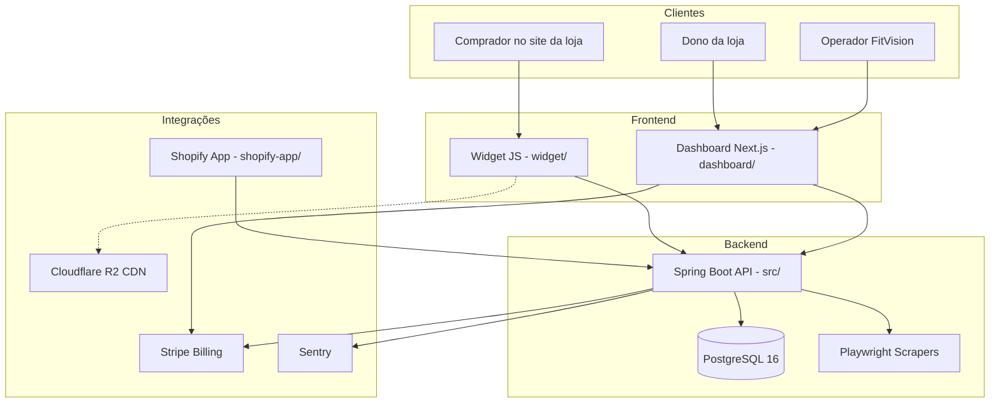

# 01 — Visão Geral

[← Índice](./README.md) | [Próximo: Documentação funcional →](./02-documentacao-funcional.md)

---

## O que é o FitVision

FitVision é uma plataforma **SaaS multi-tenant** que recomenda **tamanhos de roupa** com base em medidas corporais do comprador e tabelas de tamanhos configuradas por loja ou marca global.

**Status:** Implementado (backend, dashboard, widget, admin, billing Stripe, scraping, Shopify app, CI/CD)

---

## Problema de negócio

Lojas online sofrem com devoluções por tamanho incorreto. O FitVision:

1. Permite à loja cadastrar produtos e tabelas de tamanho (upload CSV/Excel ou manual)
2. Expõe um **widget embeddable** na página do produto
3. Calcula perfil corporal (BMI, estimativas chest/waist/hip) e faz match com a tabela
4. Regista analytics agregados por tenant (com opção GDPR de não guardar medidas brutas)

---

## Módulos runtime

| Módulo | Diretório | Tech | Porta dev |
|--------|-----------|------|-----------|
| Backend API | `/` (raiz Maven) | Spring Boot 3.3.5, Java 21 | 8080 |
| Dashboard | `/dashboard` | Next.js 14, TypeScript, Tailwind | 3000 |
| Widget | `/widget` | Vite, vanilla JS | Vite dev server |
| Shopify App | `/shopify-app` | Node.js, Express | 3001 |

---

## Personas

| Persona | Acesso | Autenticação |
|---------|--------|--------------|
| **Comprador** | Widget na loja | API key da loja (`X-FitVision-Key`) |
| **Store owner** | `/dashboard`, `/products`, `/settings` | JWT (`role=STORE`) |
| **Admin FitVision** | `/admin/*` | JWT (`role=ADMIN`) |
| **Shopify (servidor)** | `/api/shopify/*` | Shared secret header |
| **Stripe** | `/api/billing/webhooks` | Assinatura `Stripe-Signature` |

---

## Planos comerciais (código)

Definidos em `src/main/java/com/fitvision/domain/billing/Plan.java`:

| Plano | Produtos máx. | Recomendações/mês |
|-------|---------------|-------------------|
| FREE | 2 | 100 |
| STARTER | 10 | 5.000 |
| PRO | 50 | 25.000 |
| TEAM | ilimitado | ilimitado |

**Status billing:** Implementado (Stripe Checkout, portal, webhooks — `BillingController`, `StripeWebhookController`)

---

## Fases recentes (confirmadas no código)

| Fase | Conteúdo | Evidência |
|------|----------|-----------|
| 8 | Shopify OAuth, campos DB | `V7__add_shopify_fields.sql`, `ShopifyController` |
| 9 | Scraping pipeline | `V8__add_scrape_jobs.sql`, scrapers Zara/HM/Mango/Pull&Bear |
| 10 | Billing Stripe | `V9__add_billing_fields.sql`, `BillingController` |
| 11 | CI/CD Railway/Vercel/R2 | `.github/workflows/*.yml`, `railway.toml`, `vercel.json` |
| 12 | Sentry, logs JSON, admin health | `application-prod.yml`, `AdminHealthService`, `/admin/health` |

---

## Stack técnica resumida

- **Backend:** Maven, Flyway, JPA, Spring Security, JWT (jjwt), Stripe SDK, Playwright, Sentry 7.6
- **Dashboard:** SWR, Recharts, react-hook-form + Zod, Radix UI
- **Widget:** IIFE único, gzip ≤ 50 KB (`widget/build-check.js`)
- **DB:** PostgreSQL 16, migrações V1–V10
- **Deploy prod:** Railway (backend), Vercel (dashboard), R2 (widget CDN)

---

## Divergências (spec vs código)

| Tópico | ProjectContext | Código atual |
|--------|----------------|--------------|
| `SecretKeyAuthFilter` | Documentado para size-charts | **Existe mas não está na cadeia de filtros** (`SecurityConfig`) |
| `WebhookController` | Mencionado | **Placeholder vazio** — sem endpoints |
| `WidgetController` | Mencionado | **Placeholder vazio** — lógica em `WidgetRecommendationController` |
| URLs Stripe checkout | Produção | **Hardcoded `localhost:3000`** em `BillingController` |

Ver [AUDIT.md](./AUDIT.md) para lista completa.

---

## Próximos passos sugeridos

Ver [18-roadmap-pendencias.md](./18-roadmap-pendencias.md) e [AUDIT.md](./AUDIT.md).
