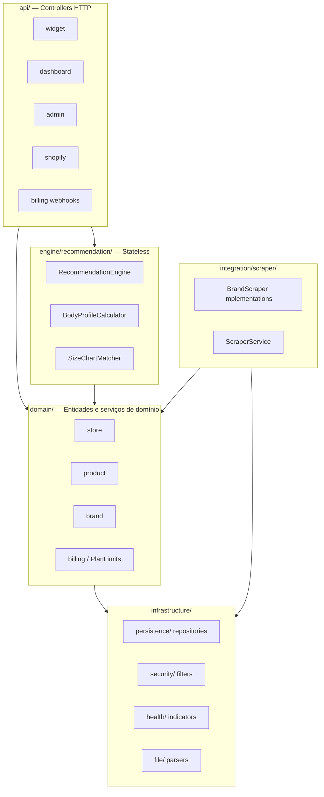
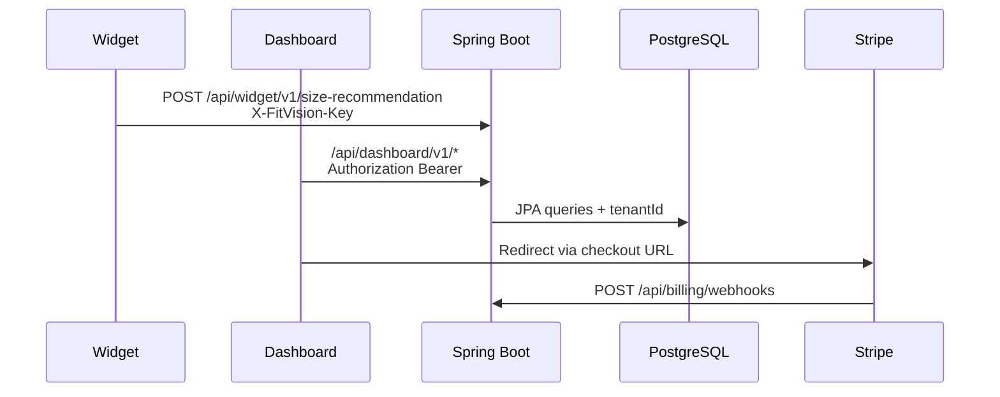

# 03 — Arquitetura Técnica

[← Documentação funcional](./02-documentacao-funcional.md) | [Índice](./README.md) | [Próximo: Fluxos →](./04-fluxos-da-aplicacao.md)

---

## Visão em camadas (backend)



**Padrão:** Controller → Service/Engine → Repository → DB. Engine **sem** acesso directo à BD.

---

## Estrutura de pacotes Java

```
com.fitvision/
├── api/
│   ├── widget/          WidgetRecommendationController
│   ├── dashboard/       store, product, brand, analytics, billing, auth
│   ├── admin/           AdminController, AdminSeedController
│   ├── shopify/         ShopifyController
│   └── billing/         StripeWebhookController
├── domain/              Entidades JPA + StripeService, PlanLimitsService
├── engine/recommendation/
├── infrastructure/
│   ├── persistence/     *Repository interfaces
│   ├── security/        Filters, JwtService, SecurityConfig
│   ├── health/          DatabaseHealthIndicator
│   └── file/            CsvSizeChartParser, ExcelSizeChartParser
├── integration/scraper/
└── shared/              ApiResponse, GlobalExceptionHandler, ErrorCode
```

---

## Dashboard (Next.js App Router)

```
dashboard/
├── app/
│   ├── (auth)/login, register
│   ├── (app)/dashboard, products, settings    # Store shell
│   └── (admin)/admin/*                        # Admin shell
├── components/
│   ├── app/       Sidebar, ProductForm, SizeChartUpload
│   ├── admin/     AdminSidebar, SystemHealthCards, GlobalBrandManager
│   └── dashboard/ BillingSection, PlanComparisonTable
├── lib/api.ts     Cliente HTTP centralizado
├── lib/auth.ts    JWT localStorage + cookie
└── middleware.ts  Protecção de rotas por role
```

**Status:** Implementado — `output: 'standalone'` em `next.config.js` para Docker

---

## Widget (Vite IIFE)

```
widget/src/
├── main.js    Entry, auto-init, window.FitVision
├── api.js     POST size-recommendation
├── config.js  Timeout 8s, URL base
├── ui.js      Formulário e render
└── styles.css Inlined no bundle
```

Build: `dist/fitvision-widget.min.js` + versão imutável `fitvision-widget.{version}.min.js`

---

## Shopify App

```
shopify-app/src/
├── index.js      Express server
├── auth.js       OAuth begin/callback
├── fitvision.js  Cliente API FitVision
├── sync.js       Sync produtos
├── inject.js     ScriptTag widget
├── webhooks.js   products/*, app/uninstalled
└── store.js      Sessão in-memory
```

**Status:** Parcial — sessão in-memory (não persistente entre restarts)

---

## Dependências principais

### Backend (`pom.xml`)

| Dependência | Versão | Uso |
|-------------|--------|-----|
| Spring Boot | 3.3.5 | Framework |
| Java | 21 | Runtime |
| Flyway | 10.15.0 | Migrações |
| PostgreSQL driver | runtime | BD |
| jjwt | — | JWT |
| Stripe Java | — | Billing |
| Playwright | — | Scraping |
| Sentry | 7.6.0 | Erros prod |
| Apache POI | — | Excel parser |
| Testcontainers | tests | IT |

### Dashboard (`package.json`)

Next.js 14.2.35, React 18, SWR, Recharts, Tailwind, Zod

---

## Comunicação entre módulos



---

## Envelope de resposta padrão

`src/main/java/com/fitvision/shared/response/ApiResponse.java`:

```json
{
  "success": true,
  "data": { },
  "error": null,
  "meta": {
    "requestId": "uuid",
    "timestamp": "2026-05-31T..."
  }
}
```

`RequestIdFilter` propaga `X-Request-Id` via MDC.

---

## Multitenancy

- **Tenant root:** entidade `Store` → tabela `stores`
- **Contexto:** `TenantContext` (ThreadLocal + MDC `tenantId`)
- **Definido por:** `ApiKeyAuthFilter`, `JwtAuthFilter`, `AdminAuthFilter`
- **Obrigatório:** repositórios tenant-scoped filtram por `TenantContext.get()`

---

## Divergências

| Componente | Estado |
|----------|--------|
| `DashboardController.java` | Placeholder — sem rotas |
| `WebhookController.java` | Placeholder |
| `SecretKeyAuthFilter` | Existe, **não registado** em `SecurityConfig` |
| Redis / cache | **Não encontrado no código atual** |
| Message queue scrape | Async via `@Async`, sem fila externa |
