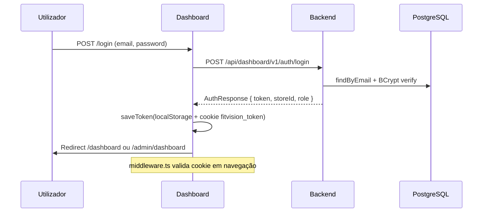
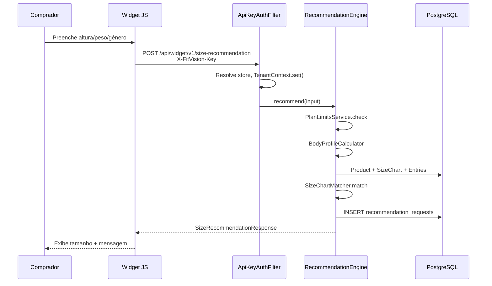
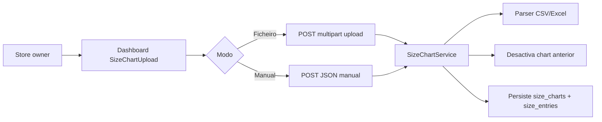
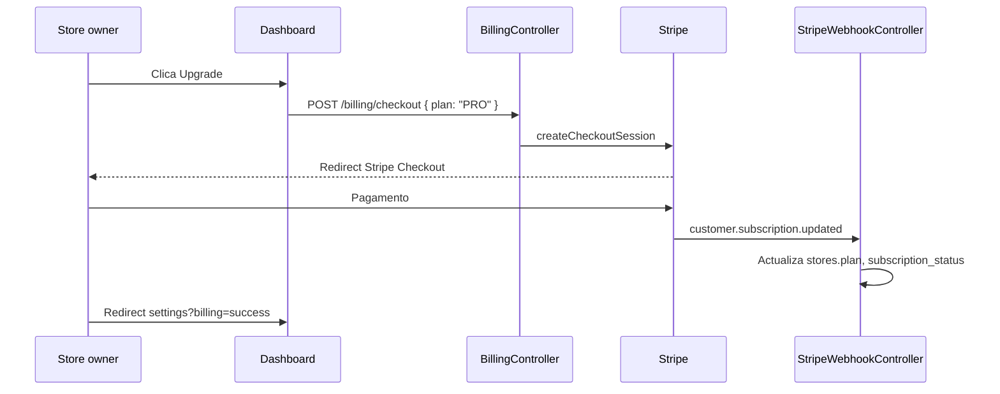
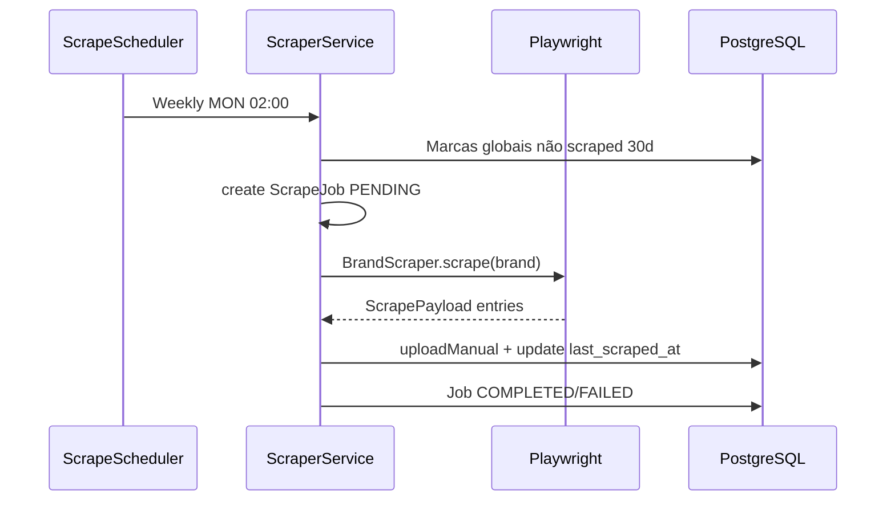
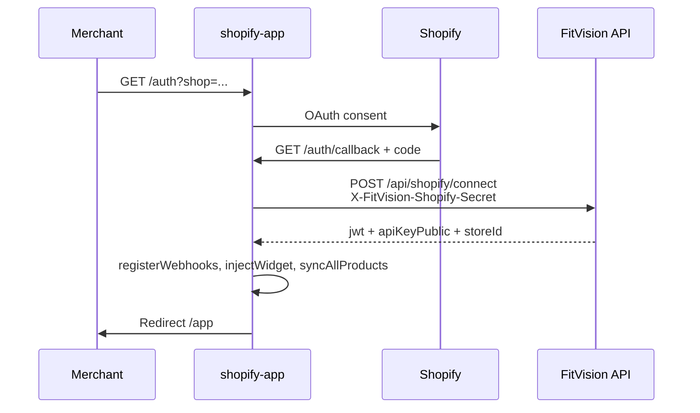
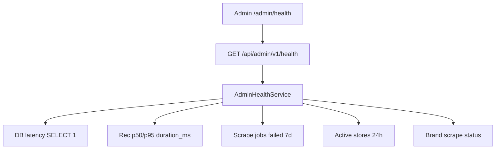

# 04 — Fluxos da Aplicação

[← Arquitetura](./03-arquitetura-tecnica.md) | [Índice](./README.md) | [Próximo: Modelo de dados →](./05-modelo-de-dados.md)

---

## 1. Autenticação store (JWT)

**Ficheiros:** `StoreAuthController`, `JwtService`, `dashboard/lib/auth.ts`, `middleware.ts`

---

## 2. Recomendação via widget

**GDPR:** Widget envia `storeBodyData: false` por defeito (`widget/src/main.js`).

**Limite de plano:** `PlanLimitException` capturada no controller → HTTP 200 + `planLimitFallback()`.

---

## 3. Upload de tabela de tamanhos

**Limite ficheiro:** 2 MB. Erros: `UNSUPPORTED_FILE_FORMAT`, `SIZE_CHART_PARSE_ERROR`.

---

## 4. Billing Stripe

**Pendente:** URLs success/cancel hardcoded `http://localhost:3000` — ver [14-configuracao-env.md](./14-configuracao-env.md).

---

## 5. Scraping de marcas globais

**Admin manual:** `POST /api/admin/v1/brands/{id}/scrape` ou `trigger-all`.

---

## 6. OAuth Shopify

---

## 7. Admin health check

**UI:** `SystemHealthCards`, `RecommendationStatsPanel`, `ScrapePipelineStatus`

---

## 8. Registo de loja

1. `POST /auth/register` — cria `Store` FREE/ACTIVE, gera API keys
2. Login → JWT 24h (configurável)
3. Settings → copiar snippet widget com `api_key_public`

---

## Divergências

| Fluxo | Nota |
|-------|------|
| Refresh token | **Não implementado** — re-login após expiração JWT |
| Webhook genérico FitVision | `WebhookController` vazio |
| 2FA admin | **Não encontrado no código atual** |
