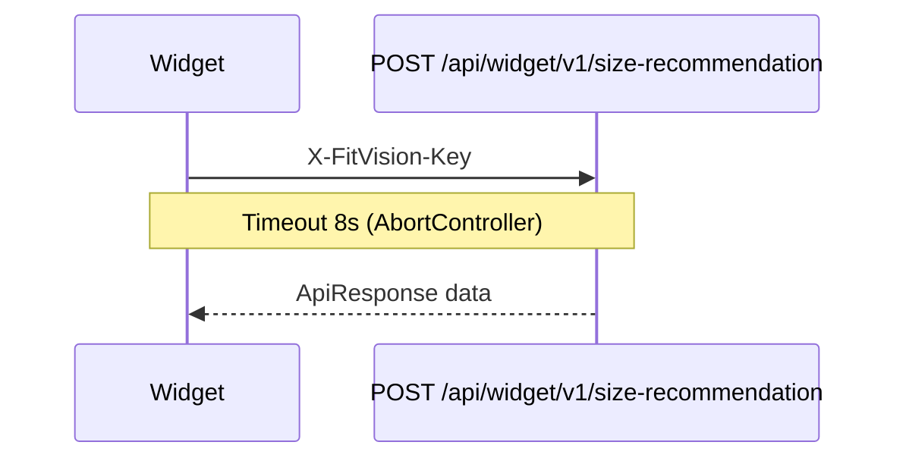

# 07 — Integração do Widget

[← API](./06-api-reference.md) | [Índice](./README.md) | [Próximo: Dashboard store →](./08-dashboard-store.md)

---

## Visão geral

**Status:** Implementado  
O widget é um bundle **IIFE** único servido via CDN, embeddable com um `<script>` e atributos `data-*` num container HTML.

| Item | Valor |
|------|-------|
| Entry | `widget/src/main.js` |
| Output | `widget/dist/fitvision-widget.min.js` |
| Versão actual | `1.0.0` |
| Limite gzip | **50 KB** (`widget/build-check.js`) |
| CDN prod | `https://cdn.fitvision.io/widget/fitvision-widget.min.js` |

---

## Instalação (embed)

Snippet gerado em **Settings** do dashboard (`dashboard/app/(app)/settings/page.tsx`):

```html
<script
  src="https://cdn.fitvision.io/widget/fitvision-widget.min.js"
  async
></script>

<div
  data-fitvision-product-id="SEU_EXTERNAL_PRODUCT_ID"
  data-fitvision-key="SUA_API_KEY_PUBLIC"
  data-fitvision-locale="pt"
></div>
```

### Atributos

| Atributo | Obrigatório | Descrição |
|----------|-------------|-----------|
| `data-fitvision-product-id` | Sim | ID do produto na plataforma (Shopify, etc.) |
| `data-fitvision-key` | Sim | `api_key_public` da loja |
| `data-fitvision-api-url` | Não | Override API (default prod: `https://api.fitvision.io`) |
| `data-fitvision-locale` | Não | `en` ou `pt` |

---

## API JavaScript global

Após load, expõe:

```javascript
window.FitVision.init();  // auto-chamado em DOMContentLoaded
window.FitVision.version; // "1.0.0"
```

---

## Contrato HTTP

**Ficheiro cliente:** `widget/src/api.js`



### Request

```json
{
  "externalProductId": "...",
  "heightCm": 175,
  "weightKg": 70,
  "gender": "FEMALE",
  "age": 28,
  "storeBodyData": false
}
```

**GDPR:** No código actual, `main.js` envia **`storeBodyData: false`** sempre.

### Response (campos UI)

| Campo | Uso na UI |
|-------|-----------|
| recommendedSize | Tamanho sugerido |
| confidenceLabel | High / Medium / Low |
| message | Texto buyer-facing |
| hasSizeChart | Estado sem tabela |
| quality | EXACT, PARTIAL, CLOSEST, NO_MATCH |

### Erros

- Rede/timeout → `NetworkError` (8s)
- HTTP ≠ 200 ou `success: false` → `ApiError` com `code`
- **Limite de plano:** backend retorna 200 + fallback — widget mostra mensagem genérica

---

## Build e validação

```bash
cd widget
npm install
npm run build   # vite build && node build-check.js
```

`build-check.js` valida:
1. Ficheiro existe e não vazio
2. Prefixo IIFE válido
3. **Gzip ≤ 50 KB**
4. Cópia versionada `fitvision-widget.{version}.min.js`

**Dev:**

```bash
npm run dev     # Vite dev server + index.html
```

---

## Deploy CDN (CI)

Workflow: `.github/workflows/widget.yml`

- Push `main` em `widget/**`
- Upload R2:
  - `fitvision-widget.min.js` — cache 5 min
  - `fitvision-widget.{version}.min.js` — immutable 1 ano
- Secret: `CLOUDFLARE_API_TOKEN`

---

## Shopify injection

A Shopify app injecta ScriptTag apontando ao CDN (`shopify-app/src/inject.js`).

**Status:** Implementado

---

## Versionamento

- Path API: `/api/widget/v1/` — contrato versionado
- Breaking changes → novo path `/v2/` (regra documentada em CLAUDE.md)
- Widget semver em `package.json` — artefacto versionado no R2

---

## Divergências

| Tópico | Nota |
|--------|------|
| WooCommerce plugin | **Não encontrado** — só embed genérico |
| Custom CSS loja | Limitado a `styles.css` inlined |
| A/B testing widget | **Não implementado** |
| Spec ProjectContext tamanho 45KB | Código exige **50KB** gzip |
