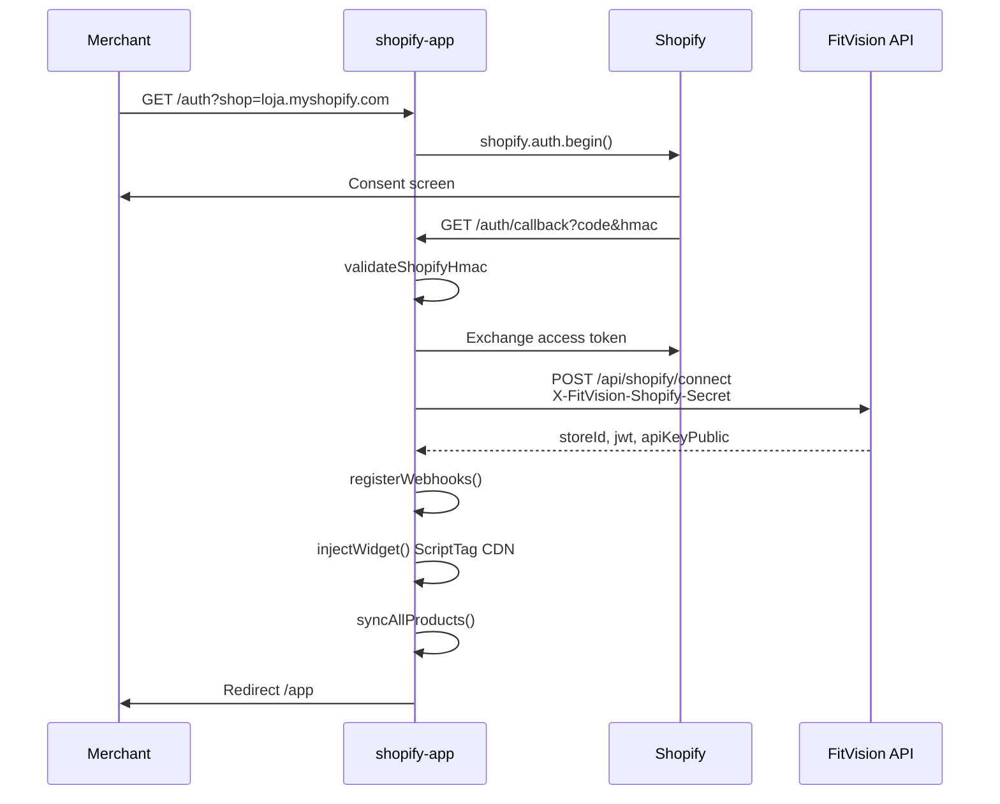

# 10 — Shopify App

[← Admin](./09-admin-area.md) | [Índice](./README.md) | [Próximo: Segurança →](./11-seguranca-e-multitenancy.md)

---

## Visão geral

**Diretório:** `shopify-app/`  
**Runtime:** Node.js + Express, porta **3001**  
**Status:** Implementado (dev); **Parcial** para produção (sessão in-memory)

---

## Arquitectura

```mermaid
graph TB
    subgraph Shopify
        SH[Shopify Admin / OAuth]
        WH[Webhooks]
    end

    subgraph shopify-app
        EX[Express index.js]
        AUTH[auth.js OAuth]
        FV[fitvision.js API client]
        SYNC[sync.js]
        INJ[inject.js ScriptTag]
    end

    subgraph FitVision
        API[Spring Boot /api/shopify]
        DASH[/api/dashboard/v1/*]
    end

    SH --> AUTH
    AUTH --> FV
    FV --> API
    SYNC --> DASH
    WH --> EX
    INJ --> SH
```

---

## Rotas Express

| Método | Path | Ficheiro | Descrição |
|--------|------|----------|-----------|
| GET | `/auth` | `auth.js` | Inicia OAuth |
| GET | `/auth/callback` | `auth.js` | Callback + connect FitVision |
| GET | `/app` | `index.js` | UI embedded (`ui/app.html`) |
| POST | `/app/sync` | `index.js` | Sync manual produtos |
| GET | `/status` | `index.js` | Estado conexão |
| POST | `/webhooks/products/create` | `webhooks.js` | |
| POST | `/webhooks/products/update` | `webhooks.js` | |
| POST | `/webhooks/products/delete` | `webhooks.js` | |
| POST | `/webhooks/app/uninstalled` | `index.js` | Desactiva loja |

---

## Fluxo OAuth



**Scopes** (`config.js`): `read_products`, `write_script_tags`

---

## Integração FitVision API

**Ficheiro:** `src/fitvision.js`

| Operação | Endpoint backend |
|----------|------------------|
| Connect | `POST /api/shopify/connect` |
| Status | `GET /api/shopify/status?shop=` |
| Login admin (refresh JWT) | `POST /api/dashboard/v1/auth/login` |
| CRUD produtos | `/api/dashboard/v1/products` com JWT loja |
| Desactivar loja uninstall | `PATCH /api/admin/v1/stores/{id}/status` |

**Shared secret:** header `X-FitVision-Shopify-Secret` — deve coincidir com `fitvision.shopify.shared-secret` no backend.

**Token Shopify:** armazenado encriptado em `stores.shopify_access_token_encrypted` (AES-256-GCM, V7).

---

## Sync de produtos

**Ficheiro:** `src/sync.js`

- Pagina `GET /admin/api/{version}/products.json?limit=250`
- Mapeia para `ProductRequest` com `externalProductId` = Shopify product id
- Create/update/delete via dashboard JWT endpoints

---

## Widget injection

**Ficheiro:** `src/inject.js`

- Cria ScriptTag apontando a `https://cdn.fitvision.io/widget/fitvision-widget.min.js`
- Remove tags antigas antes de inject

---

## Webhooks

Registados pós-install (`webhooks.js`):
- `products/create`, `products/update`, `products/delete`
- `app/uninstalled` → desactiva store via admin API

**Validação HMAC:** `middleware.js` `validateShopifyHmac`

---

## Variáveis de ambiente

Ver [14-configuracao-env.md](./14-configuracao-env.md) — `shopify-app/.env.example`

---

## Comandos

```bash
cd shopify-app
npm install
npm run dev      # nodemon :3001
npm run tunnel   # ngrok http 3001 (dev webhooks)
```

---

## Divergências

| Item | Estado |
|------|--------|
| Sessão persistente (Redis/DB) | **Não implementado** — `store.js` in-memory |
| Deploy shopify-app CI/CD | **Não encontrado** em `.github/workflows/` |
| GDPR webhook customers | **Não implementado** |
| Billing via Shopify | Usa Stripe directo, não Shopify Billing API |
| HOST_NAME prod | Manual — não documentado em infra repo |
