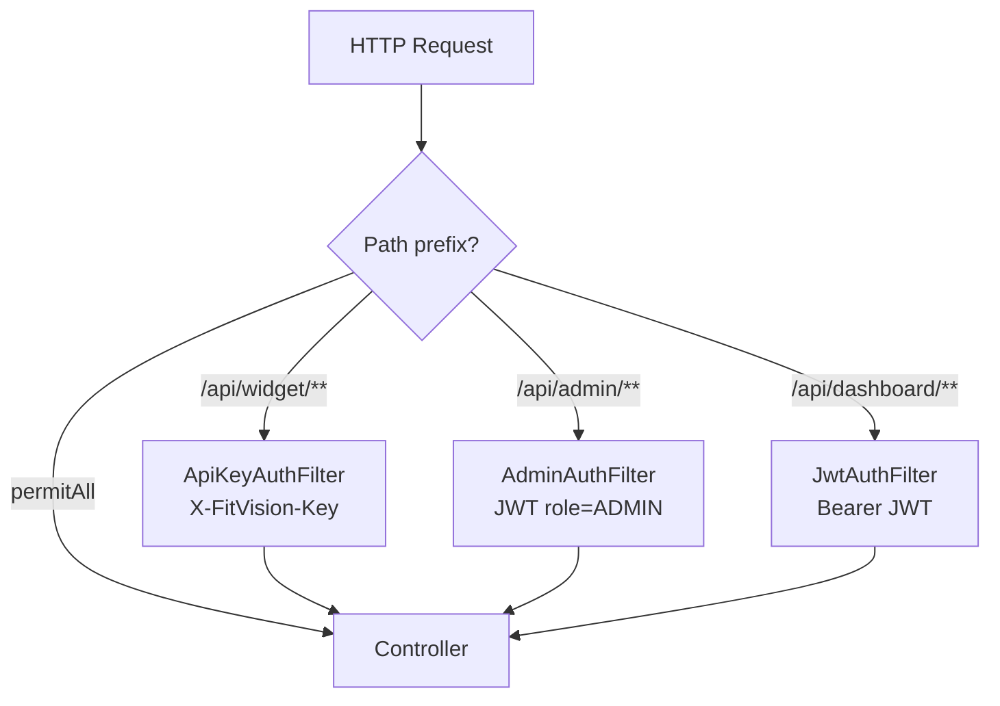

# 11 — Segurança e Multitenancy

[← Shopify](./10-shopify-app.md) | [Índice](./README.md) | [Próximo: GDPR →](./12-gdpr-e-privacidade.md)

---

## Modelo de ameaças (resumo)

| Ameaça | Mitigação no código |
|--------|---------------------|
| Acesso cross-tenant | `TenantContext` + queries com `tenantId` |
| API key roubada | Key por loja; regeneração em settings |
| JWT forged | Assinatura HMAC server-side (`JwtService`) |
| Shopify spoof | Shared secret header |
| Stripe webhook replay | Verificação `Stripe-Signature` |
| CSRF dashboard | Stateless JWT; cookie + localStorage |

---

## Cadeia de filtros Spring Security

**Ficheiro:** `infrastructure/security/SecurityConfig.java`

Ordem (antes de `UsernamePasswordAuthenticationFilter`):
1. `ApiKeyAuthFilter`
2. `AdminAuthFilter`
3. `JwtAuthFilter`



### Rotas públicas (`permitAll`)

- `/actuator/health`
- `/swagger-ui/**`, `/v3/api-docs/**`
- `/api/admin/seed`
- `/api/shopify/**`
- `/api/billing/webhooks`
- `/api/dashboard/v1/auth/**`
- `anyRequest().permitAll()` — inclui `/api/health`

---

## ApiKeyAuthFilter

**Path:** `infrastructure/security/ApiKeyAuthFilter.java`  
**Scope:** `/api/widget/**` only  
**Header:** `X-FitVision-Key`  
**Lookup:** `StoreRepository.findByApiKeyPublic` + `status=ACTIVE`  
**Efeito:** `TenantContext.set(storeId)`  
**401:** `INVALID_API_KEY`

---

## JwtAuthFilter

**Scope:** `/api/dashboard/**` exceto `/auth/**`  
**Skip:** widget, admin, actuator  
**Header:** `Authorization: Bearer {token}`  
**Validação:** store existe, ACTIVE  
**Claims:** `sub` (UUID), `email`, `role` (default STORE)

**Config JWT:**
- `fitvision.jwt.secret` — mín. 32 bytes
- `fitvision.jwt.expiration-hours` — default 24

---

## AdminAuthFilter

**Scope:** `/api/admin/**` exceto `/seed`  
**Requisito:** claim `role=ADMIN`  
**403** se JWT válido mas role errado

---

## SecretKeyAuthFilter

**Ficheiro:** existe em `infrastructure/security/SecretKeyAuthFilter.java`  
**Header:** `X-FitVision-Secret`  
**Status:** **Não registado** em `SecurityConfig` — **inactivo no código actual**

---

## TenantContext

**Ficheiro:** `infrastructure/security/TenantContext.java`

- ThreadLocal `UUID tenantId`
- MDC `tenantId` para logs
- **Obrigatório** `clear()` em `finally` nos filtros

**Padrão repositório:**

```java
repository.findByIdAndTenantId(id, TenantContext.get()); // correcto
repository.findById(id); // proibido em dados tenant-scoped
```

---

## Passwords e keys

| Item | Mecanismo |
|------|-----------|
| Password store | BCrypt strength **12** |
| API keys | Geradas no registo; regeneráveis |
| Shopify token | AES-256-GCM (`fitvision.shopify.encryption-key`) |
| Admin seed | Endpoint dedicado, 409 se existir |

---

## CORS

**Prod origins** (`SecurityConfig`):
- `https://app.fitvision.io`
- `https://fitvision.io`
- `https://*.myshopify.com`

**Widget:** origins `*` (embed em qualquer domínio loja)

---

## Dashboard middleware (client-side)

**Ficheiro:** `dashboard/middleware.ts`

- Decode JWT **sem verificar assinatura** — apenas routing
- Cookie `fitvision_token` — prod: `Secure`, `SameSite=Strict`
- **Segurança real:** backend rejeita tokens inválidos

---

## Headers de segurança dashboard

**Ficheiro:** `dashboard/next.config.js` — X-Frame-Options, CSP parcial, etc.

**Status:** Confirmar no código — headers definidos em `next.config.js`

---

## Divergências

| Item | Risco | Estado |
|------|-------|--------|
| SecretKeyAuthFilter inactivo | Baixo | Documentado em spec, não wired |
| Middleware sem verify JWT | Médio | UX routing only |
| Rate limiting | Médio | **Não implementado** |
| API keys plaintext DB | Médio | Sem hash at rest |
| `/api/admin/seed` público | Alto se exposto prod | Mitigar com rede/firewall |

Ver [AUDIT.md](./AUDIT.md) P0–P1.
