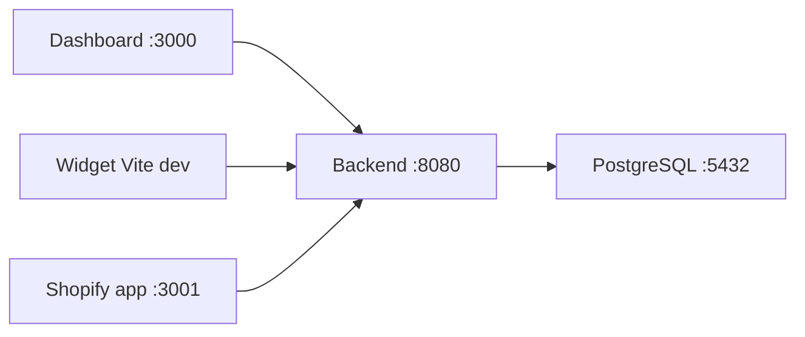

# 13 — Execução Local

[← GDPR](./12-gdpr-e-privacidade.md) | [Índice](./README.md) | [Próximo: Config env →](./14-configuracao-env.md)

---

## Pré-requisitos

| Ferramenta | Versão |
|------------|--------|
| Java | 21 |
| Maven | 3.9+ |
| Node.js | 20+ |
| Docker + Compose | Para stack completa |
| PostgreSQL | 16 (via Docker ou local) |

---

## Opção A — Docker Compose (recomendado)

```bash
# Na raiz do repositório
cp .env.example .env
# Editar FITVISION_JWT_SECRET (mín. 32 bytes)

docker compose up --build -d
docker logs devcontext-fitvision-backend-1 --tail 30
```

### Serviços

| Serviço | Porta | Imagem/Build |
|---------|-------|--------------|
| fitvision-db | 5432 | postgres:16 |
| fitvision-backend | 8080 | Dockerfile.dev |
| fitvision-dashboard | 3000 | dashboard/Dockerfile |

**URLs:**
- API: http://localhost:8080
- Swagger: http://localhost:8080/swagger-ui.html
- Dashboard: http://localhost:3000

**Rebuild após alterações backend:**

```bash
docker compose down
mvn clean package -DskipTests
docker compose up --build -d
```

---

## Opção B — Backend nativo

```bash
# PostgreSQL local ou container só DB
docker compose up fitvision-db -d

cp .env.example .env
# Ajustar DB_URL=jdbc:postgresql://localhost:5432/fitvision

mvn clean package -DskipTests
java -jar target/fitvision-backend-0.0.1-SNAPSHOT.jar
# ou: mvn spring-boot:run
```

Profile activo: `dev` (`application.yml`)

---

## Opção C — Dashboard nativo

```bash
cd dashboard
npm install
export NEXT_PUBLIC_API_URL=http://localhost:8080   # PowerShell: $env:NEXT_PUBLIC_API_URL=...
npm run dev
```

Abrir http://localhost:3000

---

## Widget dev

```bash
cd widget
npm install
npm run dev
```

Editar `index.html` com API key e product id de teste.

**Build produção local:**

```bash
npm run build   # valida gzip < 50KB
```

---

## Shopify app dev

```bash
cd shopify-app
cp .env.example .env
# Configurar SHOPIFY_API_KEY, SHOPIFY_API_SECRET, HOST_NAME (ngrok)

npm install
npm run dev          # :3001
npm run tunnel       # ngrok http 3001
```

Backend e shared secret devem coincidir com `.env` raiz.

---

## Criar conta admin

```bash
./scripts/create-admin.sh admin@fitvision.io sua-senha
```

Chama `POST /api/admin/seed` — falha 409 se admin já existir.

**Nunca** criar admin via `/auth/register`.

---

## Testes locais

```bash
# Unit tests
mvn test

# Unit + integration (Testcontainers)
mvn verify

# Teste único
mvn test -Dtest=BodyProfileCalculatorTest
mvn verify -Dit.test=WidgetRecommendationControllerIT
```

Requer Docker para Testcontainers (PostgreSQL).

---

## Portas resumo



---

## Troubleshooting

| Problema | Solução |
|----------|---------|
| Flyway validate fail | BD inconsistente — reset volume Docker |
| 401 widget | Verificar `X-FitVision-Key` e store ACTIVE |
| Playwright scrape local | Dockerfile.dev instala Chromium |
| CORS dashboard | Dev permite localhost; ver SecurityConfig |

---

## Divergências

| Item | Nota |
|------|------|
| shopify-app no compose | **Não incluído** em `docker-compose.yml` |
| Stripe local | Keys vazias OK; checkout falha até configurar |
