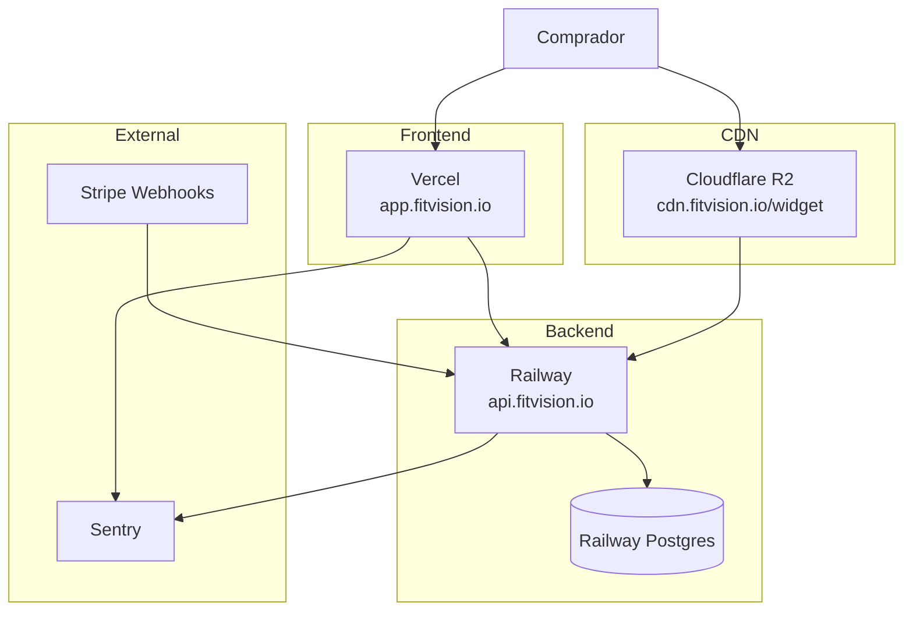

# 16 — Deploy

[← Testes](./15-testes.md) | [Índice](./README.md) | [Próximo: Observabilidade →](./17-observabilidade-operacoes.md)

---

## Arquitectura produção



**Status Phase 11:** Implementado (workflows CI/CD presentes)

---

## Backend — Railway

**Ficheiros:**
- `Dockerfile` — multi-stage Maven + JRE Alpine + Chromium Playwright
- `railway.toml`

```toml
[build]
builder = "dockerfile"

[deploy]
startCommand = "java -Dspring.profiles.active=prod -jar app.jar"
healthcheckPath = "/actuator/health"
healthcheckTimeout = 30
restartPolicyType = "on_failure"
```

**CI:** `.github/workflows/backend.yml`
1. `mvn verify` on push `main` (paths `src/**`, `pom.xml`, Dockerfiles)
2. `mvn package -DskipTests`
3. Deploy `bervProject/railway-deploy@v0.1.2-beta` service `fitvision-backend`
4. Secret: `RAILWAY_TOKEN`

**Env vars Railway (prod):** ver [14-configuracao-env.md](./14-configuracao-env.md) — `DATABASE_URL`, `JWT_SECRET`, `STRIPE_*`, `SENTRY_DSN`, etc.

---

## Dashboard — Vercel

**Ficheiro:** `dashboard/vercel.json`

```json
{
  "framework": "nextjs",
  "buildCommand": "npm run build",
  "outputDirectory": ".next",
  "rewrites": [
    { "source": "/api/:path*", "destination": "https://api.fitvision.io/api/:path*" }
  ]
}
```

**CI:** `.github/workflows/dashboard.yml`
- Trigger: push `main`, `dashboard/**`
- `npm ci && npm run build` com `NEXT_PUBLIC_API_URL` secret
- Deploy Vercel action

**Secrets:** `VERCEL_TOKEN`, `VERCEL_ORG_ID`, `VERCEL_PROJECT_ID`, `NEXT_PUBLIC_API_URL`

**Docker alternativo:** `dashboard/Dockerfile` + compose para self-host

---

## Widget — Cloudflare R2

**CI:** `.github/workflows/widget.yml`

Objects:
- `fitvision-widget/widget/fitvision-widget.min.js` — cache 5 min
- `fitvision-widget/widget/fitvision-widget.{version}.min.js` — immutable

**Secret:** `CLOUDFLARE_API_TOKEN`  
**Bucket name in workflow:** `fitvision-widget`

**CDN público:** `https://cdn.fitvision.io/widget/fitvision-widget.min.js` (referenciado em dashboard `.env.production`)

---

## Shopify App

**Status:** **Não encontrado** workflow CI/CD no repositório  
Deploy manual esperado (Railway/Fly/Heroku/ngrok dev)

---

## Docker Compose (não-prod)

`docker-compose.yml` — dev local apenas; **não** config produção.

---

## Migrações BD

Flyway automático no startup backend.  
**Ordem deploy:** backend antes de tráfego que dependa de schema V10.

---

## Stripe webhooks prod

Endpoint: `https://api.fitvision.io/api/billing/webhooks`  
Configurar no Stripe Dashboard com `STRIPE_WEBHOOK_SECRET` matching.

---

## Checklist deploy

| Passo | Responsável |
|-------|-------------|
| Env vars Railway mapeadas (nomes prod) | Ops |
| Stripe products/prices IDs em env | Ops |
| Webhook Stripe apontando prod URL | Ops |
| Vercel env `NEXT_PUBLIC_API_URL` | CI secret |
| R2 bucket + custom domain CDN | Cloudflare |
| CORS prod origins | SecurityConfig |
| Billing redirect URLs | **Pendente** — hardcoded localhost |
| Admin seed uma vez | Script manual |
| Sentry DSN + APP_VERSION | Railway |

---

## Rollback

| Componente | Estratégia |
|------------|------------|
| Backend Railway | Redeploy commit anterior via Railway |
| Dashboard Vercel | Promote deployment anterior |
| Widget R2 | Re-upload artefacto anterior (versioned path disponível) |

---

## Divergências

| Item | Estado |
|------|--------|
| Infra as Code Terraform | **Não encontrado** |
| Staging environment | **Não documentado no código** |
| Blue/green deploy | Railway default |
| WAF / rate limit edge | **Não no repo** |
